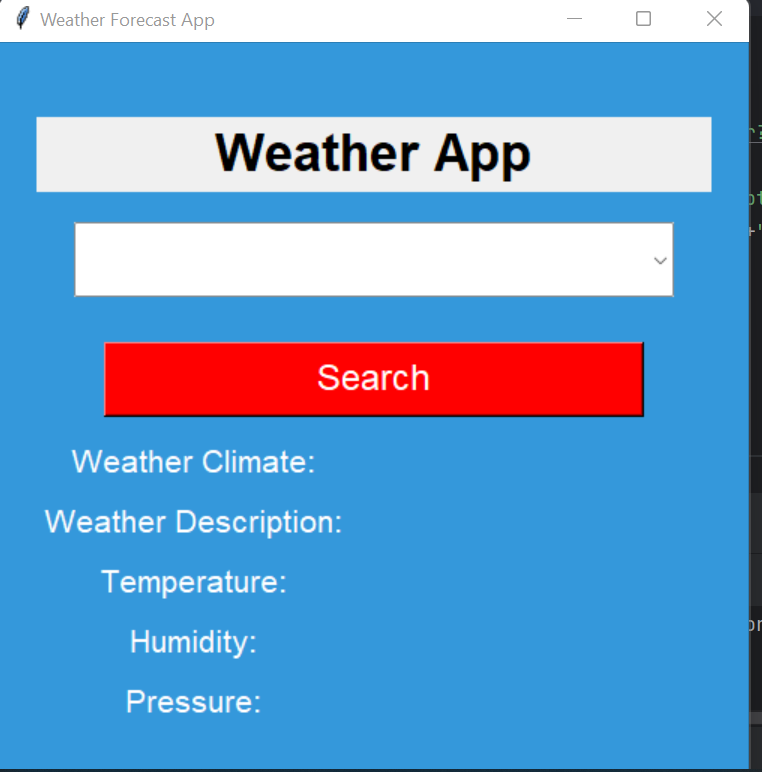
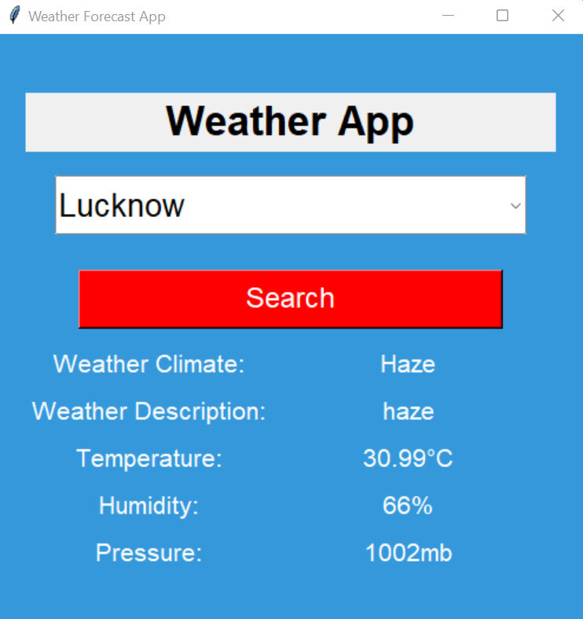

# Weather-Forecast-App-Tkinter



## Overview

This Weather Forecast App is a simple Python application that provides real-time weather information based on user-selected locations . The app uses the OpenWeatherMap API to retrieve weather data and displays it in a user-friendly graphical interface built with Tkinter.

## Features

- User-friendly graphical interface.
- Real-time weather data retrieval using the OpenWeatherMap API.
- Display of essential weather information, including weather climate, description, temperature (in Celsius), humidity percentage, and atmospheric pressure (in millibars).
- A "Search" button triggers data retrieval and updates the displayed information.

## Getting Started

To use this Weather Forecast App locally, follow these steps:

1. **Clone the Repository:**

   ```
   git clone https://github.com/shriyaa01/Weather-Forecast-App-Tkinter.git
   ```

2. **Install Dependencies:**

   Ensure you have Python installed on your system. Install the required Python packages by running the following command:

   ```
   pip install requests
   pip install tkinter
   ```

3. **API Key Setup:**

   - Get an API key from [OpenWeatherMap](https://openweathermap.org/api) by signing up for a free account.
   - Replace `YOUR_API_KEY` in the code with your actual API key in the `get_report` function.

4. **Run the Application:**

   Execute the Python script to run the application:

   ```
   python weather_app.py
   ```

5. **Usage:**

   - Choose a location from the dropdown list.
   - Click the "Search" button to retrieve weather data.
   - The weather information will be displayed on the interface.

## Technologies Used

- Python
- Tkinter (for GUI)
- Requests (for making API requests)

## Screenshots



## Contributing

Contributions are welcome! If you'd like to contribute to this project, please follow these guidelines:

- Fork the repository.
- Create a new branch for your feature or bug fix.
- Make your changes and test them thoroughly.
- Create a pull request with a clear description of your changes.


## Acknowledgments

- Weather data provided by [OpenWeatherMap](https://openweathermap.org/).

## Don't Forget to Support Us! 🌟

If you find this Weather Forecast App useful, please consider giving it a star ⭐ to show your support. Additionally, feel free to follow this repository for updates on new features and improvements.

Your support means a lot to us, and it motivates us to continue working on open-source projects like this one. Thank you for being a part of our community! 🙏

## Author

- [Shriya Srivastava](https://github.com/shriyaa01)

  
